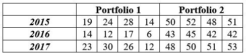
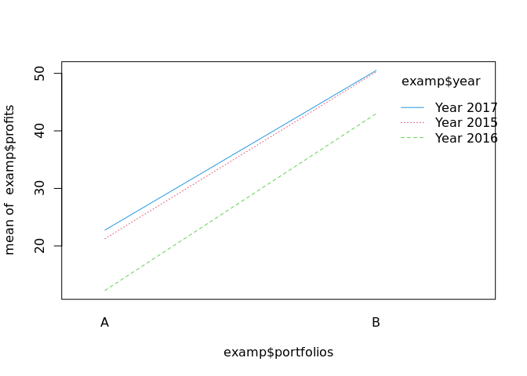
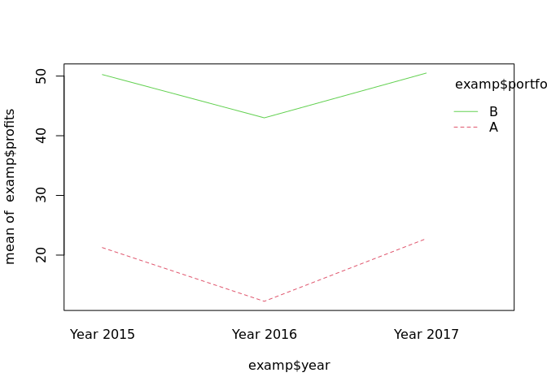

<!-- README.md is generated from README.Rmd. Please edit that file -->

# ANOVA

The data in the following table belongs to three investment portfolios
in profits in millions of dollars, during the years 2015, 2016 and 2017.
The first portfolio is from pharmaceutical companies, the second
portfolio is from banking instruments and the last investment portfolio
is from construction companies.

<!-- -->

## What has been the most convenient year for these investment portfolios?

    #>    portfolios instruments
    #> 1           A          50
    #> 2           A          52
    #> 3           A          54
    #> 4           A          53
    #> 5           A          51
    #> 6           B          65
    #> 7           B          66
    #> 8           B          69
    #> 9           B          64
    #> 10          B          68
    #> 11          C          30
    #> 12          C          32
    #> 13          C          34
    #> 14          C          33
    #> 15          C          31
    #>             Df Sum Sq Mean Sq F value   Pr(>F)    
    #> portfolios   2 2984.5  1492.3   481.4 3.48e-12 ***
    #> Residuals   12   37.2     3.1                     
    #> ---
    #> Signif. codes:  0 '***' 0.001 '**' 0.01 '*' 0.05 '.' 0.1 ' ' 1
    #>         year portfolios profits
    #> 1  Year 2015          A      19
    #> 2  Year 2015          A      24
    #> 3  Year 2015          A      28
    #> 4  Year 2015          A      14
    #> 5  Year 2015          B      50
    #> 6  Year 2015          B      52
    #> 7  Year 2015          B      48
    #> 8  Year 2015          B      51
    #> 9  Year 2016          A      14
    #> 10 Year 2016          A      12
    #> 11 Year 2016          A      17
    #> 12 Year 2016          A       6
    #> 13 Year 2016          B      43
    #> 14 Year 2016          B      45
    #> 15 Year 2016          B      42
    #> 16 Year 2016          B      42
    #> 17 Year 2017          A      23
    #> 18 Year 2017          A      30
    #> 19 Year 2017          A      26
    #> 20 Year 2017          A      12
    #> 21 Year 2017          B      48
    #> 22 Year 2017          B      50
    #> 23 Year 2017          B      51
    #> 24 Year 2017          B      53
    #>                 Df Sum Sq Mean Sq F value   Pr(>F)    
    #> year             2    394     197   9.285   0.0017 ** 
    #> portfolios       1   5104    5104 240.510 7.37e-12 ***
    #> year:portfolios  2      9       5   0.214   0.8094    
    #> Residuals       18    382      21                     
    #> ---
    #> Signif. codes:  0 '***' 0.001 '**' 0.01 '*' 0.05 '.' 0.1 ' ' 1
    #>               A     B
    #> Year 2015 21.25 50.25
    #> Year 2016 12.25 43.00
    #> Year 2017 22.75 50.50
    #> Year 2015 Year 2016 Year 2017 
    #>    35.750    27.625    36.625
    #>        A        B 
    #> 18.75000 47.91667

<!-- --><!-- -->

According to our ANOVA, marginal means and the interaction graph, the
most convenient year for our portfolios was 2017.
